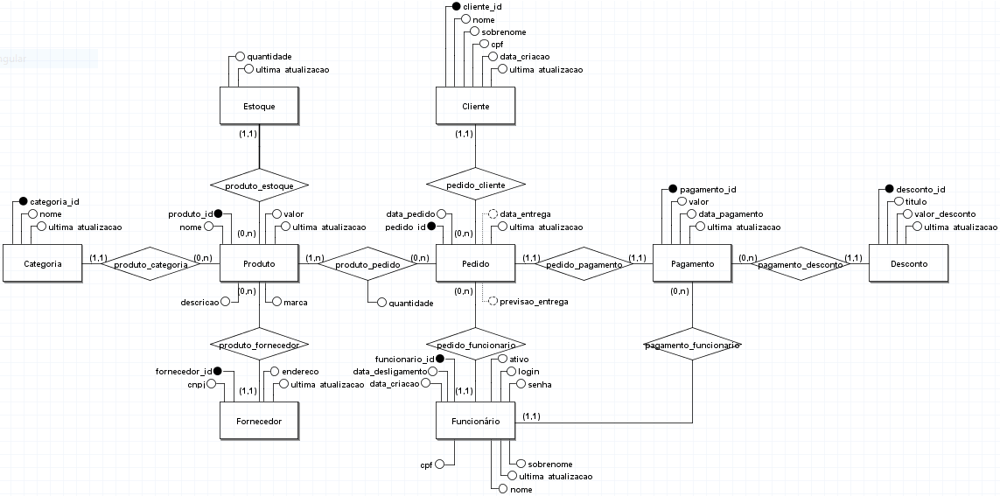

# DBArtigosMusica
## Sumário
1. Diagrama Entidade Relacionamento
2. Consultas SQL com Joins
3. Funções SQL e Procedures
4. Consultas SQL com Subqueries
5. Triggers
6. Views
7. Cursores
8. Backup do Banco
## DER
DER:

## Joins
Todos esses joins estão disponíveis em [joins.sql](joins.sql)

QUERY:
```SQL
-- seleciona nome e categoria de um produto
SELECT p.nome AS produto, c.nome AS categoria
FROM produto p
INNER JOIN categoria c ON p.categoria_id = c.categoria_id;
```
RESULTADO:
```
                 produto                  |       categoria       
------------------------------------------+-----------------------
 Ukulele Concert                          | Instrumentos Musicais
 Mesa de Som                              | Equipamentos de Áudio
 Cabo P10                                 | Acessórios
 Vinil The Beatles - Abbey Road           | Mídias Musicais
 Violão Clássico                          | Instrumentos Musicais
 Pedal de Distortion                      | Equipamentos de Áudio
 Encordoamento para Guitarra              | Acessórios
 Vinil Pink Floyd - Dark Side of the Moon | Mídias Musicais
 Guitarra Elétrica                        | Instrumentos Musicais
 Baixo Elétrico                           | Instrumentos Musicais
(10 rows)
```
QUERY:
```SQL
-- seleciona cliente e funcionario envolvidos num pedido
SELECT pe.pedido_id, cl.nome AS cliente, f.nome AS funcionario
FROM pedido pe
INNER JOIN cliente cl ON pe.cliente_id = cl.cliente_id
INNER JOIN funcionario f ON pe.funcionario_id = f.funcionario_id;
```
RESULTADO:
```
 pedido_id | cliente | funcionario 
-----------+---------+-------------
         1 | Eliezio | Thiago
         2 | Moroni  | Ismaelly
         3 | Keylly  | Ismaelly
(3 rows)
```
QUERY:
```SQL
-- seleciona valor e data de pagamento de um pedido
SELECT pe.pedido_id, pa.valor AS valor_pagamento, pa.data_pagamento
FROM pedido pe
INNER JOIN pagamento pa ON pa.pedido_id = pe.pedido_id;
```
RESULTADO:
```
 pedido_id | valor_pagamento |       data_pagamento       
-----------+-----------------+----------------------------
         1 |         1800.00 | 2024-09-15 08:39:08.878418
         2 |          200.00 | 2024-09-15 08:39:08.878418
         3 |         1200.00 | 2024-09-15 08:39:08.878418
(3 rows)
```
QUERY:
```SQL
 -- seleciona nome do produto, quantidade em estoque e cnpj do fornecedor
SELECT p.nome AS produto, e.quantidade AS quantidade_estoque, f.cnpj AS fornecedor
FROM produto p
INNER JOIN estoque e ON p.produto_id = e.produto_id
INNER JOIN fornecedor f ON p.fornecedor_id = f.fornecedor_id;
```
RESULTADO:
```
            produto             | quantidade_estoque |     fornecedor     
--------------------------------+--------------------+--------------------
 Guitarra Elétrica              |                 50 | 12.345.678/0001-90
 Ukulele Concert                |                100 | 12.345.678/0001-90
 Mesa de Som                    |                200 | 98.765.432/0001-10
 Cabo P10                       |                 20 | 11.222.333/0001-55
 Vinil The Beatles - Abbey Road |                  5 | 12.345.678/0001-90
 Violão Clássico                |                  3 | 98.765.432/0001-10
 Pedal de Distortion            |                150 | 11.222.333/0001-55
 Encordoamento para Guitarra    |                  7 | 55.444.333/0001-20
 Baixo Elétrico                 |                 12 | 66.777.888/0001-30
(9 rows)
```
QUERY:
```SQL
-- seleciona nome do produto, título do desconto aplicado e valor total do pagamento
SELECT pe.pedido_id AS pedido, p.nome AS produto, d.titulo AS desconto, pa.valor AS valor_pagamento
FROM pagamento pa
INNER JOIN pedido pe ON pa.pedido_id = pe.pedido_id
INNER JOIN item_pedido ip ON ip.pedido_id = pe.pedido_id
INNER JOIN produto p ON ip.produto_id = p.produto_id
INNER JOIN desconto d ON pa.desconto_id = d.desconto_id;
```
RESULTADO:
```
 pedido |      produto      |        desconto         | valor_pagamento 
--------+-------------------+-------------------------+-----------------
      1 | Cabo P10          | Desconto de Inauguração |         1800.00
      1 | Ukulele Concert   | Desconto de Inauguração |         1800.00
      1 | Guitarra Elétrica | Desconto de Inauguração |         1800.00
      2 | Mesa de Som       | Desconto de Verão       |          200.00
      2 | Ukulele Concert   | Desconto de Verão       |          200.00
      3 | Ukulele Concert   | Desconto de Inauguração |         1200.00
(6 rows)
```
QUERY:
```SQL
-- seleciona nome do cliente, nome do produto e quantidade do item no pedido
SELECT c.nome AS cliente, p.nome AS produto, ip.quantidade AS quantidade
FROM item_pedido ip
INNER JOIN pedido pe ON ip.pedido_id = pe.pedido_id
INNER JOIN cliente c ON pe.cliente_id = c.cliente_id
INNER JOIN produto p ON ip.produto_id = p.produto_id;
```
RESULTADO:
```
 cliente |      produto      | quantidade 
---------+-------------------+------------
 Eliezio | Guitarra Elétrica |          1
 Eliezio | Ukulele Concert   |          1
 Eliezio | Cabo P10          |          1
 Moroni  | Ukulele Concert   |          1
 Moroni  | Mesa de Som       |          1
 Keylly  | Ukulele Concert   |          1
(6 rows)
```
## Funções
Todas essas funções estão disponíveis em [functions.sql](functions.sql)
## Procedures
Todas essas procedures estão disponíveis em [procedures.sql](procedures.sql)
## Subqueries
Todas essas subqueries estão disponíveis em [subqueries.sql](subqueries.sql)

QUERY:
```SQL
 -- produtos acima da média de preço da categoria
SELECT p.produto_id, p.nome, p.valor, p.categoria_id
FROM produto p
WHERE p.valor > (
    SELECT AVG(p2.valor)
    FROM produto p2
    WHERE p2.categoria_id = p.categoria_id
);
```
RESULTADO:
```
 produto_id |                   nome                   |   valor   | categoria_id 
------------+------------------------------------------+-----------+--------------
          3 | Mesa de Som                              |   2500.00 |            2
          4 | Cabo P10                                 |     50.00 |            3
         10 | Vinil Pink Floyd - Dark Side of the Moon |    180.00 |            4
          1 | Guitarra Elétrica                        | 3675.0000 |            1
          9 | Baixo Elétrico                           | 2940.0000 |            1
(5 rows)
```
QUERY:
```SQL
-- produto mais vendido (acima da média em relação aos outros produtos)
SELECT p.nome, COUNT(ip.pedido_id) AS total_vendido
FROM produto p
JOIN item_pedido ip ON p.produto_id = ip.produto_id
GROUP BY p.nome
HAVING COUNT(ip.pedido_id) > (
    SELECT AVG(sub.total_vendido)
    FROM (
        SELECT COUNT(ip2.pedido_id) AS total_vendido
        FROM produto p2
        JOIN item_pedido ip2 ON p2.produto_id = ip2.produto_id
        GROUP BY p2.produto_id
    ) AS sub
);
```
RESULTADO:
```
      nome       | total_vendido 
-----------------+---------------
 Ukulele Concert |             3
(1 row)
```
QUERY:
```SQL
-- cliente com maior valor gasto
SELECT c.nome, c.sobrenome, SUM(pg.valor) AS total_gasto
FROM cliente c
JOIN pedido pe ON c.cliente_id = pe.cliente_id
JOIN pagamento pg ON pe.pedido_id = pg.pedido_id
GROUP BY c.nome, c.sobrenome
HAVING SUM(pg.valor) = (
    SELECT MAX(total_gasto)
    FROM (
        SELECT SUM(pg2.valor) AS total_gasto
        FROM cliente c2
        JOIN pedido pe2 ON c2.cliente_id = pe2.cliente_id
        JOIN pagamento pg2 ON pe2.pedido_id = pg2.pedido_id
        GROUP BY c2.cliente_id
    ) AS sub
);
```
RESULTADO:
```
  nome   | sobrenome | total_gasto 
---------+-----------+-------------
 Eliezio | Soares    |     1800.00
(1 row)
```
## Triggers
## Views
Todas essas views estão disponíveis em [views.sql](views.sql)

VIEW:
```SQL
-- visualiza informações básicas de um pedido
CREATE VIEW resumo_simples AS
SELECT pe.pedido_id, cl.nome AS cliente, p.nome AS produto FROM pedido pe
INNER JOIN cliente cl ON pe.cliente_id = cl.cliente_id
INNER JOIN item_pedido ip ON pe.pedido_id = ip.pedido_id
INNER JOIN produto p ON ip.produto_id = p.produto_id;
```
QUERY:
```SQL
-- seleciona a view
SELECT * FROM resumo_simples;
```
RESULTADO:
```
 pedido_id | cliente |      produto      
-----------+---------+-------------------
         1 | Eliezio | Guitarra Elétrica
         1 | Eliezio | Ukulele Concert
         1 | Eliezio | Cabo P10
         2 | Moroni  | Ukulele Concert
         2 | Moroni  | Mesa de Som
         3 | Keylly  | Ukulele Concert
(6 rows)
```
VIEW:
```SQL
-- visualiza informações de estoque e vendas
CREATE VIEW resumo_estoque_vendas AS
SELECT p.nome AS produto, e.quantidade AS quantidade_estoque, COALESCE(SUM(ip.quantidade), 0) AS quantidade_vendida
FROM produto p
INNER JOIN estoque e ON p.produto_id = e.produto_id
LEFT JOIN item_pedido ip ON p.produto_id = ip.produto_id
GROUP BY p.nome, e.quantidade;
```
QUERY:
```SQL
 -- seleciona a view
SELECT * FROM resumo_estoque_vendas;
```
RESULTADO:
```
            produto             | quantidade_estoque | quantidade_vendida 
--------------------------------+--------------------+--------------------
 Pedal de Distortion            |                150 |                  0
 Cabo P10                       |                 20 |                  1
 Vinil The Beatles - Abbey Road |                  5 |                  0
 Ukulele Concert                |                100 |                  3
 Encordoamento para Guitarra    |                  7 |                  0
 Mesa de Som                    |                200 |                  1
 Guitarra Elétrica              |                 50 |                  1
 Baixo Elétrico                 |                 12 |                  0
 Violão Clássico                |                  3 |                  0
(9 rows)
```
## Cursores
Todos esses cursores estão disponíveis em [cursores.sql](cursores.sql)

CURSOR:
``` SQL
-- lista produtos com quantidade menor do que 10 no estoque
CREATE OR REPLACE FUNCTION listar_produtos_com_estoque_baixo()
RETURNS VOID AS $$
DECLARE
    cur_estoque_baixo CURSOR FOR
    SELECT p.produto_id, p.nome, e.quantidade
    FROM produto p
    JOIN estoque e ON p.produto_id = e.produto_id
    WHERE e.quantidade < 10;
    
    produto_id INTEGER;
    nome TEXT;
    quantidade INTEGER;
BEGIN
    OPEN cur_estoque_baixo;
    
    LOOP
        FETCH cur_estoque_baixo INTO produto_id, nome, quantidade;
        EXIT WHEN NOT FOUND;
        
        RAISE NOTICE 'Produto ID: %, Nome: %, Quantidade em estoque: %', produto_id, nome, quantidade;
    END LOOP;
    
    CLOSE cur_estoque_baixo;
END
$$ LANGUAGE plpgsql;
```
QUERY:
```SQL
SELECT listar_produtos_com_estoque_baixo();
```
RESULTADO: (SAÍDA NA ABA "MESSAGES")
```
NOTICE:  Produto ID: 5, Nome: Vinil The Beatles - Abbey Road, Quantidade em estoque: 5
NOTICE:  Produto ID: 6, Nome: Violão Clássico, Quantidade em estoque: 3
NOTICE:  Produto ID: 8, Nome: Encordoamento para Guitarra, Quantidade em estoque: 7
```

CURSOR:
``` SQL
-- atualiza valor de produto com base em percentual por marca
CREATE OR REPLACE FUNCTION ajustar_valor_produtos_por_marca(
    p_marca TEXT,             -- Marca específica
    p_percentual NUMERIC      -- Percentual de ajuste (ex.: 1.10 para +10%, 0.90 para -10%)
)
RETURNS VOID AS $$
DECLARE
    cur_atualizar_produto CURSOR FOR
    SELECT produto_id, valor
    FROM produto
    WHERE marca = p_marca;

    id_produto INTEGER;
    valor_produto NUMERIC;
BEGIN
    OPEN cur_atualizar_produto;

    LOOP
        FETCH cur_atualizar_produto INTO id_produto, valor_produto;
        EXIT WHEN NOT FOUND;

        UPDATE produto
        SET valor = valor_produto * p_percentual,
            ultima_atualizacao = CURRENT_TIMESTAMP
        WHERE produto_id = id_produto;

        RAISE NOTICE 'Produto ID: %, Valor antigo: %, Valor novo: %', 
                     id_produto, valor_produto, valor_produto * p_percentual;
    END LOOP;

    CLOSE cur_atualizar_produto;
END
$$ LANGUAGE plpgsql;
```
QUERY:
```SQL
SELECT ajustar_valor_produtos_por_marca('Fender', 1.05);
```
RESULTADO: (SAÍDA NA ABA "MESSAGES")
```
NOTICE:  Produto ID: 1, Valor antigo: 3500.00, Valor novo: 3675.0000
NOTICE:  Produto ID: 9, Valor antigo: 2800.00, Valor novo: 2940.0000
```
## Backup
Após criar todas as estruturas e dados persistentes no banco de dados, um backup foi realizado da seguinte forma:
### Backup no Linux
Dentro do diretório do repositório, os seguintes comandos foram executados:
```shell
sudo su
mkdir backup
chmod 777 backup
su postgres
pg_dump DBArtigosMusica > ./backup/BKP_DBArtigosMusica.sql
```
### Backup no Windows
QUE DEUS PERDOE ESSAS POBRES ALMAS QUE USAM WINDOWS